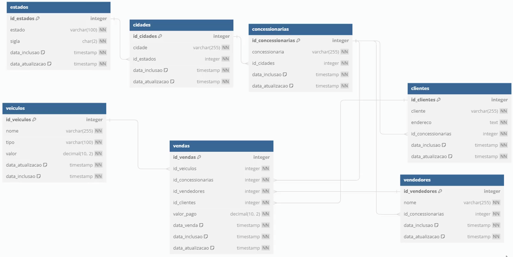

# 🚗 Projeto de Engenharia de Dados – NovaDrive Motors

Este repositório documenta todas as etapas de um projeto completo de engenharia de dados desenvolvido durante o **Bootcamp de Engenharia de Dados**, promovido pela **Escola de Inteligência Artificial (EIA)** e conduzido por **Fernando Amaral**.

O projeto simula o papel de um engenheiro de dados responsável por construir um pipeline de ponta a ponta, usando ferramentas modernas como **PostgreSQL**, **Apache Airflow**, **Snowflake**, **DBT** e **Google Looker Studio**.

---

## 💼 Cenário do Desafio

Você assume o papel de engenheiro de dados na empresa fictícia **NovaDrive Motors**, especializada na venda de veículos. O time de liderança da empresa apresenta a seguinte missão:

> “Precisamos transformar nossos dados brutos em informações acionáveis. Queremos visualizar indicadores como:
> - Vendas por concessionária  
> - Vendas por tipo de veículo  
> - Vendas por vendedor  
> - Análise de desempenho ao longo do tempo”

---

## 🧩 Visão Geral da Solução

A arquitetura adotada para atender essa demanda segue o modelo **ELT (Extract, Load, Transform)**, com o seguinte fluxo:

### 🔁 Pipeline de Dados

1. *Extração: Coletamos os dados diretamente do banco **PostgreSQL**.
2. *Carga (Load): Utilizamos o **Apache Airflow** para transferir os dados para o **Snowflake** na camada Stage.
3. *Transformação: Através do **DBT**, estruturamos os dados na camada Analytics.
4. *Visualização: Os dados transformados são conectados ao **Google Looker Studio** para criação de dashboards.

📊 Representação visual da arquitetura:

---

## 🔍 1. Análise Exploratória no PostgreSQL

A primeira etapa foi explorar a base de dados no **PostgreSQL** usando **PgAdmin** para entender as tabelas disponíveis e os relacionamentos.

### Estrutura das Tabelas

As tabelas principais são:

- cidades
- clientes
- concessionarias
- estados
- vendas
- veiculos
- vendedores

📌 Diagrama relacional:

### Exercícios de Exploração

No diretório [atividades-sql](./postgreSQL/atividades-sql), foram desenvolvidas 11 consultas SQL para exercitar a exploração dos dados, incluindo:

- Seleções com filtros
- Junções simples e múltiplas
- Subconsultas
- Agregações
- Filtros com datas e condições

💡 Os dados no banco são dinâmicos, com novas entradas inseridas automaticamente, simulando um ambiente de produção.

📂 [Veja os arquivos SQL](./postgreSQL/README.md)

---

## ⚙ 2. Orquestração com Apache Airflow

Configuramos o **Apache Airflow** em uma **VM da AWS (EC2)** utilizando *Docker*, para orquestrar a movimentação de dados entre o PostgreSQL e o Snowflake.

### DAG criada: postgres_to_snowflake_etl

Essa DAG executa diariamente e realiza:

- Verificação da maior chave primária no destino
- Extração incremental dos dados no PostgreSQL
- Carga eficiente para o Snowflake (camada Stage)

📂 [Código da DAG e detalhes](./airflow/README.md)

---

## 🧊 3. Armazenamento e Processamento no Snowflake

O **Snowflake** foi utilizado como **Data Warehouse**, organizado em duas camadas:

- Stage: Armazena os dados brutos extraídos do PostgreSQL.
- Analytics: Contém os dados modelados e prontos para análise.

### Configurações realizadas:

- Banco de dados: novadrive
- Schema: stage
- Warehouse: DEFAULT_WH
- Tabelas: Estruturadas conforme os dados extraídos

📂 [Scripts SQL e configuração](./snowflake/README.md)

---

## 🛠 4. Transformações com DBT

Com o **DBT (Data Build Tool)**, transformamos os dados da camada Stage em modelos analíticos na camada Analytics, aplicando:

- Regras de negócio
- Filtros e junções
- Agregações por categorias

Esses modelos formam a base para as análises de vendas e os dashboards.

📂 [Modelos e estrutura do DBT](./dbt/README.md)

---

## 📊 5. Visualização com Google Looker Studio

A camada Analytics do Snowflake foi conectada ao **Google Looker Studio** para criação de um painel visual com os indicadores solicitados:

- Total de vendas por concessionária
- Desempenho por tipo de veículo
- Ranking de vendedores
- Tendência de vendas ao longo do tempo

📂 [Capturas e relatório](./looker-studio/README.md)

---

## 🧠 Principais Aprendizados

Durante o desenvolvimento do projeto, foram aplicadas boas práticas de engenharia de dados e aprendidos conceitos fundamentais, como:

- Criação de pipelines escaláveis com Airflow
- Uso de containers Docker para orquestração
- Design de camadas em Data Warehouses
- Modelagem analítica com DBT
- Visualização de dados com foco em negócios

---

## 🧰 Tecnologias Utilizadas

| Ferramenta         | Função                                 |
|--------------------|-----------------------------------------|
| PostgreSQL         | Banco relacional de origem              |
| PgAdmin            | Interface para exploração dos dados     |
| Apache Airflow     | Orquestração de pipelines               |
| Docker             | Containerização do ambiente             |
| Snowflake          | Data Warehouse em nuvem                 |
| DBT                | Transformações e modelagem de dados     |
| Google Looker Studio | Visualização de dashboards           |