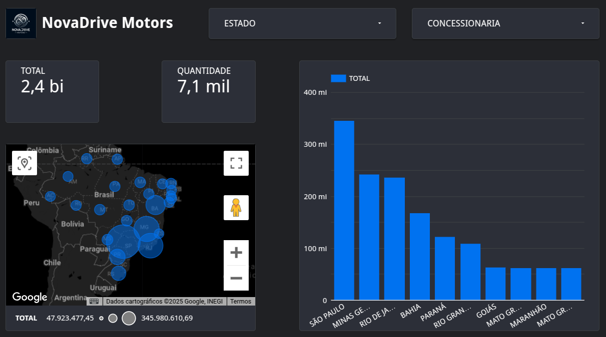

# 📊 Dashboard de Vendas - Google Looker Studio

## 🔎 Visão Geral
Este projeto utiliza o *Google Looker Studio* para criar um *painel interativo de análise de vendas, com base nos dados armazenados e processados no* **Snowflake**.  
O objetivo é fornecer uma *visão clara e dinâmica* do desempenho das concessionárias, permitindo identificar *tendências, variações regionais e oportunidades de melhoria*.

---

## 📈 Detalhes do Dashboard
O relatório conta com visualizações que destacam:
- *Vendas totais por concessionária*  
- *Comparativos entre diferentes filiais e períodos*  
- *Gráficos e filtros interativos* para explorar os dados em tempo real  

---

## 🖼 Visualização

---

## ⚙ Tecnologias Utilizadas
- *Google Looker Studio* → criação do dashboard e visualizações  
- *Snowflake* → armazenamento e tratamento dos dados  
- *SQL* → consultas para preparação e modelagem dos dados